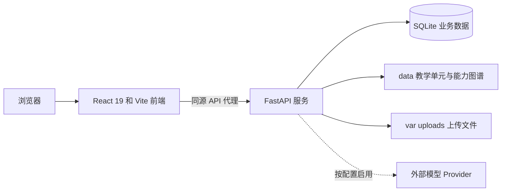

# 标航智导

标航智导是一个面向数据标注教学场景的角色化 Agent 平台。它将学生学习工作台、学习任务、能力图谱和知识库检索，与教师的班级管理、任务发布和学习分析，以及系统管理员的 Provider、RAG、用户和审计管理整合在同一套应用中。

项目采用前后端分离架构：React/Vite 前端通过同源 `/api` 代理访问 FastAPI 后端；后端使用 SQLite 保存业务数据，并从仓库中的教学内容和能力图谱加载受控素材。

> 本 README 说明当前仓库的本地开发与受控部署入口。模型回答、邮件发送、外部 Provider 连通性和真实浏览器行为均取决于实际配置和单独验收；健康检查或离线测试不等同于生产可用性证明。

## 主要能力

| 面向角色 | 能力 |
| --- | --- |
| 学生 | Agent 学习工作台、学习预设、能力图谱、学习任务与练习、个人资料与掌握度、文件与媒体附件、诊断流程 |
| 教师 | 班级与邀请码管理、任务编排与发布、学生诊断与学习分析、教师 Agent 工作流 |
| 系统管理员 | 用户与安全管理、Provider 配置与连通性检查、RAG 文档生命周期、来源台账、审计日志与运行指标 |
| 平台 | Cookie 会话认证、角色权限控制、SSE 运行事件、SQLite 迁移与恢复、受控本地 RAG 素材和能力图谱 |

## 架构概览



前端默认运行在 `127.0.0.1:5173`，后端默认运行在 `127.0.0.1:8787`。Vite 将 `/api` 转发到后端，因此本地浏览器会话和 SSE 默认走同一前端来源。

## 仓库结构

```text
.
|- app/                 React、TypeScript 和 Vite 前端
|- server/              FastAPI 后端、SQLite 迁移和后端测试
|  `- bhzd_py/          应用、路由、Agent、RAG、图谱与安全模块
|- data/                教学单元、能力图谱和来源注册数据
|- docs/                RAG 素材与相关文档资产
|- deploy/              初始化、启动、备份、恢复和部署自检脚本
|- scripts/             内容构建、校验和辅助工具
|- var/                 本地运行数据、数据库、上传和日志，不提交
|- .env.example         本地配置模板
`- start-project.bat    Windows 一键本地启动器
```

## 环境要求

- Windows 本地启动：PowerShell 或命令提示符。
- Node.js `>=22.12.0` 和 pnpm `11.3`。
- Python `>=3.11` 和 `uv`。
- 运行时使用 SQLite，不需要额外安装数据库服务器。

开始前确认以下命令可用：

```powershell
node --version
pnpm --version
python --version
uv --version
```

## 首次初始化

以下命令从仓库根目录执行。初始化脚本会依据锁文件安装前后端依赖，并创建本地配置模板；不会覆盖已有的 `.env.local`。

```powershell
.\deploy\Initialize-BHZD.ps1 -CreateLocalConfig
```

随后打开 `.env.local`，为本地管理员和将来需要保存的 Provider 配置明确设置合适的值。不要提交该文件。

```dotenv
BHZD_ADMIN_EMAIL=admin@bhzd.local
BHZD_ADMIN_PASSWORD=<choose-a-local-admin-password>
BHZD_CONFIG_ENCRYPTION_KEY=<32-byte-hex-or-base64>
```

首次创建数据库和初始系统管理员：

```powershell
.\deploy\Initialize-Database.ps1
```

该脚本使用可重复执行的种子加载器：它会应用缺失迁移并补齐基础记录，不会重置已有业务数据。若未预先设置 `BHZD_ADMIN_PASSWORD`，种子程序会生成一次性随机管理员密码并只输出到当前终端，因此建议在首次运行前显式配置管理员密码。

### 可选：本地演示数据

演示种子会向当前配置的数据库添加演示账号、班级、任务、文档和评测数据。它只适合隔离的本地开发数据库；不要对承载真实教学数据的数据库执行。

```powershell
.\deploy\Initialize-Database.ps1 -Demo
```

`BHZD_DEMO_MODE` 用于控制演示模式相关的运行时行为，默认关闭。演示账号凭据属于开发样例，不应写入公开文档或用于任何非隔离环境。

## 启动应用

### Windows 一键启动

推荐使用根目录启动器。它会检查 `5173` 和 `8787` 端口，并且只会复用可确认属于当前项目的服务；依赖缺失时会按锁文件准备环境。

```powershell
.\start-project.bat
```

不自动打开浏览器时：

```powershell
.\start-project.bat --no-browser
```

### 手动启动

需要分别启动后端和前端时，打开两个终端。

后端：

```powershell
Set-Location server
uv run --locked python -m bhzd_py.main
```

前端：

```powershell
Set-Location app
pnpm dev -- --host 127.0.0.1 --port 5173
```

后端启动时会校验生产配置、应用数据库迁移，并恢复可恢复的中断 Agent、RAG 和任务工作；这不替代首次执行的初始管理员种子步骤。

## 本地访问与健康检查

| 入口 | 默认地址 | 用途 |
| --- | --- | --- |
| 前端应用 | `http://127.0.0.1:5173` | 日常本地访问 |
| Swagger UI | `http://127.0.0.1:8787/docs` | API 交互文档 |
| 后端健康检查 | `http://127.0.0.1:8787/api/health` | 验证 FastAPI 服务是否响应 |
| 前端代理健康检查 | `http://127.0.0.1:5173/api/health` | 验证 Vite 到后端的 API 代理 |

PowerShell 快速检查：

```powershell
Invoke-RestMethod http://127.0.0.1:8787/api/health
Invoke-RestMethod http://127.0.0.1:5173/api/health
```

预期健康检查返回 `status` 为 `ok` 并带有版本字段。它只说明服务和代理可达，不能证明邮件、外部模型或真实用户流程已完成验收。

## 配置说明

配置由根目录 `.env` 和 `.env.local` 加载，环境变量优先。除 `NODE_ENV` 外，应用配置使用 `BHZD_` 前缀；完整模板见 `.env.example`，定义见 `server/bhzd_py/config.py`。

| 变量 | 默认值或用途 |
| --- | --- |
| `BHZD_HOST`、`BHZD_PORT` | 后端监听地址和端口；默认 `127.0.0.1:8787`。 |
| `BHZD_PUBLIC_ORIGIN`、`BHZD_CORS_ORIGINS` | 浏览器来源和允许的跨域来源；本地默认前端地址为 `127.0.0.1:5173`。 |
| `BHZD_DATABASE_PATH` | SQLite 数据库路径；默认是 `var/bhzd.sqlite`。 |
| `BHZD_DATA_DIR`、`BHZD_UPLOAD_DIR` | 教学内容和图谱目录，以及上传文件目录。 |
| `BHZD_CONFIG_ENCRYPTION_KEY` | Provider 密钥加密所需的 32 字节密钥编码。生产环境必须配置，并应通过独立安全渠道管理。 |
| `BHZD_ADMIN_EMAIL`、`BHZD_ADMIN_PASSWORD` | 初始系统管理员配置，仅在首次种子创建时使用。 |
| `BHZD_SMTP_HOST` 等 | 邮件服务配置。开发环境未配置 SMTP 时，邮件链接会写入本地 outbox。 |
| `BHZD_DEMO_MODE` | 是否允许演示模式相关行为；默认关闭。 |
| `NODE_ENV` | `development` 或 `production`。production 会启用更严格的启动配置校验。 |

生产环境至少需要有效的 `BHZD_CONFIG_ENCRYPTION_KEY`、SMTP 配置、非开发默认发件人、明确的 HTTPS `BHZD_PUBLIC_ORIGIN`，以及只包含具体 HTTPS 来源的 `BHZD_CORS_ORIGINS`。不要将密码、Provider API Key、加密密钥、会话令牌或数据库副本写入仓库、Issue 或日志。

## 验证与测试

按变更范围选择检查命令。前端命令从 `app` 目录执行：

```powershell
Set-Location app
pnpm run lint
pnpm run typecheck
pnpm run test:run
pnpm run build
```

后端命令从 `server` 目录执行：

```powershell
Set-Location server
uv run pytest -q
uv run ruff check .
uv run mypy
```

仓库也提供部署自检脚本，用于检查后端健康、前端代理和数据库迁移记录：

```powershell
.\deploy\Test-Deployment.ps1
```

测试和构建结果应按实际执行环境记录。特别是，模拟或离线测试、编译通过或健康检查通过，不能替代已配置 Provider、真实浏览器流程、RAG 质量或生产部署的专项验证。

## 运维边界

- 启动、停止或重启服务前，先确认监听端口所属 PID、命令行和工作目录，避免影响同机其他项目。
- 备份或恢复数据库前，使用 `deploy` 目录中的受控脚本并确认目标路径；不要直接复制仍在写入的 SQLite WAL 文件。
- 对外访问应经审查过的反向代理和 TLS 配置处理。不要直接把本地 FastAPI 开发端口暴露到公网。
- 变更代码前请阅读仓库根目录 `AGENTS.md`，其中包含任务审查、测试、服务操作和工作日志要求。

## 常见问题

### uv 或 pnpm 不可用

先安装对应工具并确保它们位于 `PATH`，然后重新执行 `Initialize-BHZD.ps1`。不要通过手动修改锁文件绕过依赖同步。

### 5173 或 8787 端口被占用

先确认监听进程归属，再决定是否停止：

```powershell
Get-NetTCPConnection -LocalPort 5173,8787 -State Listen |
  Select-Object LocalAddress,LocalPort,OwningProcess
```

若端口由其他项目占用，请使用不同端口或由对应项目的维护者处理；不要仅因端口冲突终止未知进程。

### 登录、邮件或 Provider 行为异常

先分别检查后端健康地址、前端代理健康地址和 `.env.local` 中的相关配置。开发环境的邮件 outbox 和 Provider 模拟结果只能用于本地诊断，不能作为外部服务已配置完成的证据。
